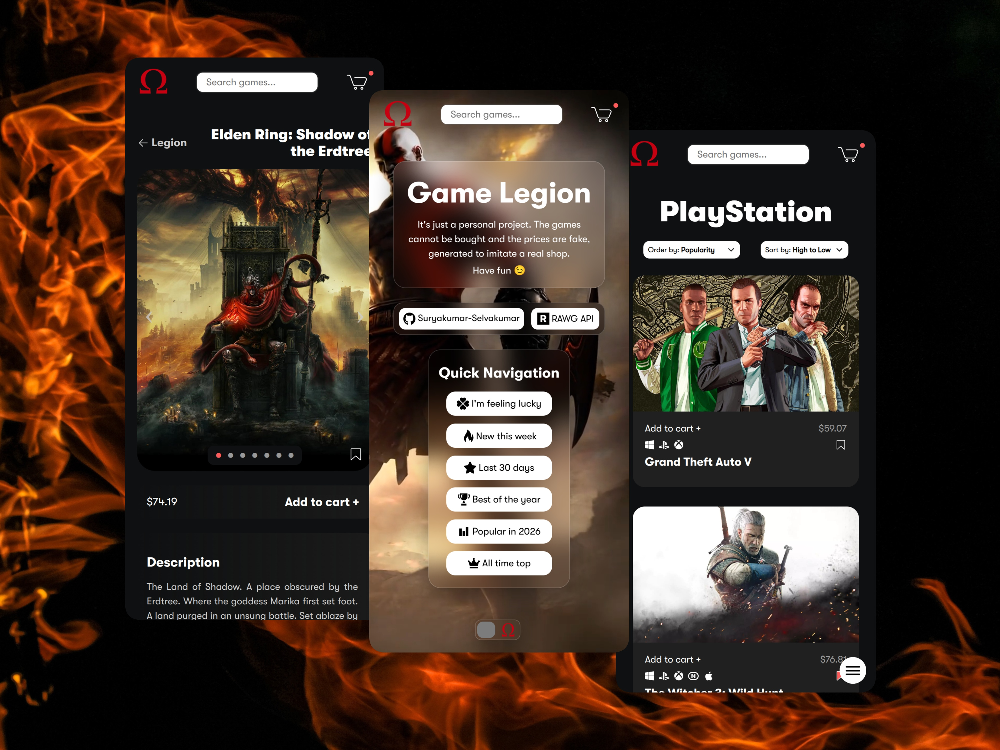

<h1 align='center'>Game Legion</h1>

   

Unleash your inner Spartan & Conquer the trials of Olympus! A God of War themed Gaming store with a catalog of over 500000 games!

## Domain

https://game-legion.vercel.app

## Features

- Extensive Catalog - 500000+ games via [RAWG API](https://rawg.io/apidocs)
- Unlimited Access - Search any game you want
- Dedicated Game data - Get information & screenshots for any game
- Responsive Design - Mobile-Friendly with Unique Layouts
- Natural Animations/Transitions - Made possible with [Motion](https://motion.dev/)
- Client-side routing with Exclusive pages - Facilitated by [React Router](https://reactrouter.com/)
- Boundless Customization - Use Filters, Ordering, & Sorting to find any games you want
- Divergent Storage - Cart to store games the user wants to "buy" & Wishlist to store games the user "likes".
- Impeccable Integration - Holistic Integration Testing was carried out using [Vitest](https://vitest.dev/) & [React Testing Library](https://testing-library.com/docs/react-testing-library/intro/)
- God of War themed - Choose between Greek & Norse variants 

## Technologies

## Screenshots

   
   
   

## Project Plan

For a detailed thought process and planning behind building this project, please refer to the [Project Plan Document](./project-plan.md).